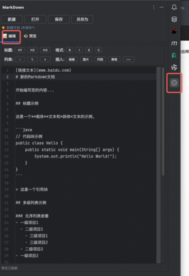
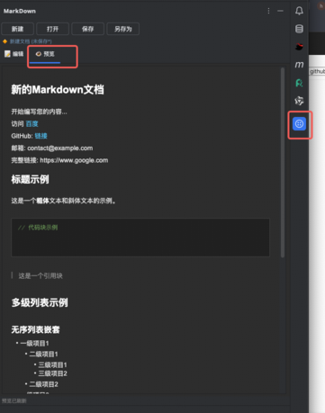

# 🚀 Markdown Editor Plugin

[](LICENSE)
[](https://plugins.jetbrains.com/)
[](https://www.oracle.com/java/)

一个 **IntelliJ IDEA** Markdown 编辑器插件，提供完整的文本编辑、实时预览和丰富的 Markdown 处理功能。

## ✨ 主要特性

### 📝 **高级编辑功能**
- 🔤 **智能语法高亮** - 完整的Markdown语法着色
- 📏 **行号显示** - 清晰的代码行标识
- 🔍 **代码折叠** - 大文档结构化查看
- 💡 **智能补全** - 提高编写效率
- 🎨 **实时预览** - 所见即所得的编辑体验

### 👁️ **强大预览系统**
- 🔄 **实时渲染** - 编辑时即时更新预览
- 📱 **响应式布局** - 适配不同窗口大小
- 🎯 **精确定位** - 编辑区与预览区同步滚动

### 🔗 **智能链接处理**
- 🌐 **全协议支持** - HTTP、HTTPS、FTP、mailto、file等
- 🚀 **一键跳转** - 点击链接自动在默认应用中打开
- 🛡️ **安全过滤** - 智能识别并过滤危险链接
- 📧 **邮件集成** - 直接打开邮件客户端


### 🛠️ **格式化工具栏**
- ⚡ **快捷按钮** - 标题、粗体、斜体、链接等
- 📝 **一键插入** - 光标位置直接插入格式符号
- 🔧 **多行布局** - 支持滚动，按钮完整显示
- 🎨 **美观界面** - 紧凑高效的工具设计

### 📁 **完整文件操作**
- 📄 **新建文件** - 快速创建Markdown文档
- 📂 **打开文件** - 支持本地文件选择
- 💾 **保存功能** - 一键保存当前内容
- 📋 **另存为** - 灵活的文件导出选项

## 📸 功能截图





## 🚀 安装指南

### 方式一：从插件市场安装（推荐）
1. 打开 `IntelliJ IDEA`
2. 前往 `File` → `Settings` → `Plugins`
3. 搜索 `"Markdown Editor"`
4. 点击 `Install` 安装插件o'c
5. 重启 IDE 完成安装


### 方式二：手动安装
1. 下载最新版本的 `markdown-editor-plugin-1.0.0.zip`
2. 打开 `IntelliJ IDEA`
3. 前往 `File` → `Settings` → `Plugins`
4. 点击 ⚙️ 齿轮图标 → `Install Plugin from Disk...`
5. 选择下载的 ZIP 文件
6. 重启 IDE 完成安装

### 系统要求
- **IntelliJ IDEA** 2024.3 或更高版本
- **Java** 17 或更高版本
- **操作系统** Windows、macOS、Linux

## 📖 使用方法

### 基础使用
1. **打开插件** - 在右侧工具窗口找到 `"MarkDown"` 标签
2. **编辑内容** - 在 `"📝 编辑"` 标签页中编写 Markdown 内容
3. **预览效果** - 在 `"👁️ 预览"` 标签页中查看实时效果
4. **切换主题** - 使用预览工具栏的主题选择器

### 快捷操作
```markdown
# 支持的 Markdown 语法

## 标题
# 一级标题
## 二级标题
### 三级标题

## 文本格式
**粗体文本**
*斜体文本*
`行内代码`

## 链接和图片
[链接文本](https://example.com)


## 列表
- 无序列表项
1. 有序列表项

## 代码块
```java
public class Hello {
    public static void main(String[] args) {
        System.out.println("Hello World!");
    }
}
```

## 表格
| 列1 | 列2 | 列3 |
|-----|-----|-----|
| 数据1 | 数据2 | 数据3 |
```

### 高级功能
- **主题切换** - 在预览工具栏选择不同主题
- **链接跳转** - 点击预览中的链接自动在外部应用打开
- **文件操作** - 使用工具栏的新建、打开、保存按钮
- **格式插入** - 使用编辑器顶部的格式化按钮

## 🛠️ 技术栈

### 核心技术
- **Java 17** - 主要开发语言
- **IntelliJ Platform SDK** - 插件开发框架
- **Gradle 8.14** - 构建工具
- **JCEF (Java Chromium Embedded Framework)** - 浏览器组件

### 关键组件
- **MarkdownProcessor** - Markdown 到 HTML 转换引擎
- **MarkdownPreviewPanel** - 实时预览组件
- **MarkdownToolWindow** - 主工具窗口
- **CefRequestHandler** - 链接点击处理器

### UI 组件
- **JBTabbedPane** - 标签页容器
- **EditorFactory** - 文本编辑器
- **JBCefBrowser** - 嵌入式浏览器
- **JToolBar** - 工具栏组件

## 🔧 开发指南

### 环境准备
```bash
# 克隆项目
git clone <repository-url>
cd markdown-editor-plugin

# 构建项目
./gradlew build

# 运行插件（开发模式）
./gradlew runIde

# 生成插件包
./gradlew buildPlugin
```

### 项目结构
```
markdown-editor-plugin/
├── src/main/java/com/markdown/editor/
│   ├── actions/          # 操作和动作
│   ├── dialog/           # 对话框组件
│   ├── editor/           # 编辑器相关
│   ├── file/             # 文件类型定义
│   ├── highlight/        # 语法高亮
│   ├── preview/          # 预览功能
│   ├── settings/         # 设置配置
│   └── toolwindow/       # 工具窗口
├── src/main/resources/
│   ├── icons/            # 图标资源
│   ├── images/           # 截图和图片
│   └── META-INF/         # 插件元数据
├── build.gradle.kts      # 构建配置
└── README.md             # 项目文档
```

### 代码规范
- 使用 **UTF-8** 编码
- 遵循 **Java 代码规范**
- 类名使用 **PascalCase**
- 方法名使用 **camelCase**
- 常量使用 **UPPER_SNAKE_CASE**

### 调试技巧
```java
// 查看插件输出日志
System.out.println("🔍 调试信息: " + info);

// 在 IDE 中查看：
// Help → Show Log in Explorer/Finder
// 查找 idea.log 文件中的插件输出
```

## 🧪 测试

### 功能测试
1. **代码块渲染** - 测试各种语言的代码高亮
2. **主题切换** - 验证三种主题的正确显示
3. **链接处理** - 测试各种协议链接的跳转
4. **文件操作** - 验证新建、打开、保存功能
5. **格式工具** - 测试快捷按钮的插入功能

### 兼容性测试
- **IntelliJ IDEA** 2024.3+
- **操作系统** Windows 10+、macOS 10.15+、Ubuntu 20.04+
- **Java 版本** 17、21

## 🤝 贡献指南

### 参与开发
1. **Fork** 项目到你的 GitHub 账户
2. **创建分支** `git checkout -b feature/amazing-feature`
3. **提交更改** `git commit -m 'Add amazing feature'`
4. **推送分支** `git push origin feature/amazing-feature`
5. **创建 Pull Request**

### 问题报告
- 使用 [GitHub Issues](https://github.com/helloHuiW/markdown-editor-plugin/issues) 报告 Bug
- 提供详细的复现步骤和环境信息
- 包含相关的日志和截图

### 功能建议
- 在 Issues 中提出新功能建议
- 描述功能的使用场景和预期效果
- 欢迎提供设计方案和实现思路

## 📜 更新日志

### v1.0.0 (2025-09-01)
- ✨ **新功能**
  - 集成式工具窗口设计
  - 三种预览主题支持
  - 全协议链接处理
  - 格式化工具栏
  - 完整文件操作

- 🐛 **问题修复**
  - 代码块缩进保持
  - 主题实时切换
  - 链接安全过滤
  - 工具栏布局优化

- 🔧 **性能优化**
  - 实时预览性能提升
  - 内存使用优化
  - 启动速度改进
### v1.0.1 (2025-09-09)  
 - 🐛 **问题修复**
  - 预览模式下表格展示不正常

## 📄 许可证

本项目采用 [Apache License 2.0](LICENSE) 许可证。

```
Copyright 2024 Markdown Editor Plugin

Licensed under the Apache License, Version 2.0 (the "License");
you may not use this file except in compliance with the License.
You may obtain a copy of the License at

    http://www.apache.org/licenses/LICENSE-2.0

Unless required by applicable law or agreed to in writing, software
distributed under the License is distributed on an "AS IS" BASIS,
WITHOUT WARRANTIES OR CONDITIONS OF ANY KIND, either express or implied.
See the License for the specific language governing permissions and
limitations under the License.
```

## 🙏 致谢

感谢以下项目和社区的支持：
- [IntelliJ Platform SDK](https://plugins.jetbrains.com/docs/intellij/)
- [JetBrains](https://www.jetbrains.com/) 提供的优秀开发工具
- [Markdown](https://daringfireball.net/projects/markdown/) 标记语言
- 所有贡献者和用户的反馈

## 📞 联系方式

- **邮箱**: 327398329@qq.com
- **GitHub**: [项目地址](https://github.com/helloHuiW/markdown-editor-plugin)
- **Issues**: [问题反馈](https://github.com/helloHuiW/markdown-editor-plugin/issues)

---

<div align="center">

**🌟 如果这个项目对您有帮助，请给个 Star 支持一下！🌟**

[⬆️ 回到顶部](#-markdown-editor-plugin)

</div>

**请作者喝杯瑞幸☕**


